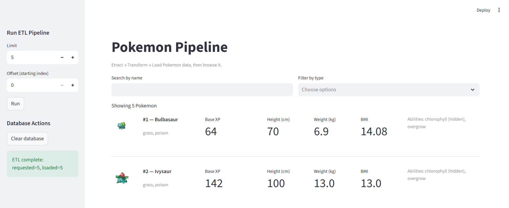

# PokePipeline


**PokePipeline** is a data engineering focused project that converts the public PokeAPI into a fully modeled, analytics-ready dataset.  
Rather than being a simple PokeAPI demo, this project implements a complete ETL workflow:

- **Extract** data asynchronously in batches  
- **Transform** nested JSON into a normalized relational schema, including validation and derived features such as BMI  
- **Load** the cleaned data into a local SQLite database using SQLAlchemy ORM  
- **Explore** the final dataset through an interactive Streamlit UI  

The system handles schema creation, many-to-many relationships, batch ingestion, and feature engineering, then exposes the processed dataset through a lightweight browser interface.  

The entire application can be run locally or through a **Dockerized deployment**, which packages the ETL pipeline, database, and Streamlit UI into a reproducible and platform-independent environment.  
It brings together practical data engineering concepts such as async ingestion, schema modeling, validation, orchestration logic, and deployment readiness.

## Technology Stack

| Layer | Library |
|-------|----------|
| API client | `httpx` (async) |
| ORM / Database | `SQLAlchemy` |
| Validation | `pydantic` |
| Environment config | `python-dotenv` |
| Web UI | `streamlit` |
| Testing | `pytest` |
| Database | SQLite (`pokemon.db`) |

---

## Setup and Usage

### Run with Docker (Recommended)

You can run the entire PokePipeline project using Docker. This option does not require Python, pip, or any local setup.

### 1. Build the Docker image

```bash
docker build -t pokepipeline .
docker run --rm -p 8501:8501 pokepipeline
```

### 2. Start the Streamlit app

Now open the app in your browser:

http://localhost:8501

Inside the UI you can:

Run the ETL pipeline

Clear and reload the database

Browse, search, and filter Pokemon data

Everything runs inside the container.

Notes:
- Works on macOS, Windows, and Linux
- Port 8501 inside the container is mapped to port 8501 on your machine
- The Docker image includes Python, dependencies, the ETL pipeline, and the Streamlit UI

### Run locally on your machine

### macOS
Follow the steps below if you are using macOS.

**1. Clone the repository and create a virtual environment**
```bash
git clone https://github.com/Akash-Ad/
cd Aventa_Coding_Challenge

python3 -m venv venv
source venv/bin/activate
pip install -r requirements.txt
```

**2. Run the ETL**
```bash
export PYTHONPATH="."
python -m pokepipeline.cli --limit 20 --offset 0
```
**Expected output:**
```text
requested=20 loaded=20
```

**3. Launch the Streamlit app**
```bash
export PYTHONPATH="."
streamlit run UI/streamlit_app.py
```
### Windows (PowerShell)

Follow the steps below if you are using Windows.

**1. Clone the repository and create a virtual environment**
```powershell
git clone https://github.com/Akash-Ad/
cd 

python -m venv venv
venv\Scripts\activate
pip install -r requirements.txt
```
**2. Run the ETL**
```powershell
$env:PYTHONPATH="."
python -m pokepipeline.cli --limit 20 --offset 0
```
**Expected output**
```text
requested=20 loaded=20
```

**3. Launch the Streamlit app**
```powershell
$env:PYTHONPATH="."
streamlit run UI/streamlit_app.py
```

The Streamlit UI provides:
 - Inputs for limit and offset
 - A Run ETL button
 - A Clear Database button
 - Search and type filters for browsing Pokemon

`pokemon.db` is created automatically. To refresh data, clear the database and run ETL again.

## Project structure

```text
pokepipeline/
├── __init__.py
├── config.py          # Database configuration
├── db.py              # Engine, session, and schema utilities
├── models.py          # ORM model definitions
├── etl.py             # Extract / Transform / Load logic
├── pipeline.py        # ETL orchestration logic
└── cli.py             # Command-line entry point
UI/
└── streamlit_app.py   # Streamlit dashboard
tests/
├── test_transform.py  # Transformation unit tests
└── test_db.py         # Database schema tests
requirements.txt
.gitignore
README.md
pokemon.db  (created automatically)
```

## Database Schema
The ETL pipeline loads cleaned Pokemon data into a normalized SQLite database using SQLAlchemy ORM.
The schema models Pokemon, their types, abilities, and stats using proper many-to-many relationships.

### pokemon

| Column          | Type                      | Description                            |
| --------------- | ------------------------- | -------------------------------------- |
| id              | INTEGER (PK)              | Pokemon ID from the API                |
| name            | STRING (unique, not null) | Pokemon name                           |
| base_experience | INTEGER, nullable         | Base experience value                  |
| height_cm       | INTEGER (not null)        | Height converted to centimeters        |
| weight_kg       | FLOAT (not null)          | Weight converted to kilograms          |
| bmi             | FLOAT, nullable           | Derived BMI                            |
| sprite_url      | TEXT, nullable            | Default sprite URL                     |
| loaded_at       | DATETIME (default now)    | Timestamp when the record was inserted |


### type

| Column | Type                      | Description |
| ------ | ------------------------- | ----------- |
| id     | INTEGER (PK)              |             |
| name   | STRING (unique, not null) |             |

### ability

| Column | Type                      | Description |
| ------ | ------------------------- | ----------- |
| id     | INTEGER (PK)              |             |
| name   | STRING (unique, not null) |             |

### stat

| Column | Type                      | Description |
| ------ | ------------------------- | ----------- |
| id     | INTEGER (PK)              |             |
| name   | STRING (unique, not null) |             |


### pokemon_type (association table)
Links Pokemon to their types.

| Column     | Type                                          | Description |
| ---------- | --------------------------------------------- | ----------- |
| pokemon_id | INTEGER (PK, FK -> pokemon.id)                |             |
| type_id    | INTEGER (PK, FK -> type.id)                   |             |
| slot       | INTEGER (not null) — type order (1 = primary) |             |

### pokemon_ability (association table)

| Column     | Type                              | Description                   |
| ---------- | --------------------------------- | ----------------------------- |
| pokemon_id | INTEGER (PK, FK -> pokemon.id)    |                               |
| ability_id | INTEGER (PK, FK -> ability.id)    |                               |
| is_hidden  | BOOLEAN (not null, default False) | Whether the ability is hidden |
| slot       | INTEGER (not null)                | Ability order                 |

### pokemon_stat (association table)

| Column     | Type                           | Description     |
| ---------- | ------------------------------ | --------------- |
| pokemon_id | INTEGER (PK, FK -> pokemon.id) |                 |
| stat_id    | INTEGER (PK, FK -> stat.id)    |                 |
| base_stat  | INTEGER (not null)             | Base stat value |
| effort     | INTEGER (not null)             | Effort value    |


### Relationship Overview
```
pokemon 1 ---* pokemon_type *--- 1 type
pokemon 1 ---* pokemon_ability *--- 1 ability
pokemon 1 ---* pokemon_stat *--- 1 stat
```

## Architecture Overview

The system follows a simple but complete end-to-end data workflow:

                       ┌───────────────────┐
                       │     PokeAPI       │
                       │   (Public API)    │
                       └─────────┬─────────┘
                                 │
                                 │ 1. Extract (async httpx)
                                 ▼
                   ┌─────────────────────────────────┐
                   │          Extract Layer          │
                   │ - Async API requests            │
                   │ - Batch fetching (limit/offset) │
                   └──────────────┬──────────────────┘
                                  │
                                  │ 2. Transform (clean + normalize)
                                  ▼
                   ┌─────────────────────────────────┐
                   │         Transform Layer         │
                   │ - Pydantic validation           │
                   │ - Unit conversion               │
                   │ - BMI derivation                │
                   └──────────────┬──────────────────┘
                                  │
                                  │ 3. Load (ORM upsert, transactions)
                                  ▼
                   ┌─────────────────────────────────┐
                   │        Load Layer (ORM)         │
                   │ - SQLAlchemy ORM                │
                   │ - Upsert + cascades             │
                   │ - Transactions per batch        │
                   └──────────────┬──────────────────┘
                                  │
                                  │ Writes to
                                  ▼
                       ┌───────────────────────┐
                       │     SQLite Database    │
                       │       pokemon.db       │
                       └───────────┬───────────┘
                                   │
                                   │ Reads from
                                   ▼
                     ┌────────────────────────────────┐
                     │         Streamlit UI           │
                     │ - Run ETL manually             │
                     │ - Clear DB                     │
                     │ - Browse, search, filter       │
                     └────────────────────────────────┘

This architecture provides:

- Async ingestion for faster throughput  
- A clean separation between extraction, transformation, and loading  
- A normalized relational schema for analytics-friendly modeling  
- A lightweight UI for interacting with the stored Pokemon dataset 

## Tests

### Run tests
```bash
pytest -q
```
```css
2 passed in 0.43s
```
### Tests included
  - test_transform.py — validates transformation logic, unit conversions, and BMI calculation
  - test_db.py — validates schema creation and round-trip persistence using SQLite


## Key Implementation Details
 - SQLite backend by default for simplicity (path configurable via DB_PATH).
 - Asynchronous extraction with httpx improves throughput.
 - Transactional inserts ensure each batch commits atomically.
 - Upsert logic avoids duplicate primary key insertions.
 - Unit normalization — height (cm), weight (kg), and derived BMI field.
 - Offset-based pagination allows incremental ETL loading.
 - Streamlit UI for clear visualization and interaction.
 - Minimal tests confirm correctness.


## Future improvements
- Incremental ETL runs – Store the last processed offset to continue loading from where the previous run stopped, avoiding duplicate fetches.
- Page navigation and sorting in the Streamlit app – Allow users to browse Pokemon results page by page and sort by attributes like height, weight, or base experience.
- Selective reloads – Add an option to fetch or refresh data for a specific Pokemon by name or ID without rebuilding the entire dataset.
- Database flexibility – Support PostgreSQL or DuckDB for larger datasets or for integration into analytical workflows.
- Improved observability – Introduce structured logging and request timing to better track API performance and data quality.
- Containerized setup – Package the app and dependencies into a Docker image for easier deployment.
- API / GraphQL layer – Expose the loaded Pokemon data as a REST or GraphQL endpoint for external applications to consume.
  
## Example Output
Example Streamlit UI after running ETL (limit = 5):
